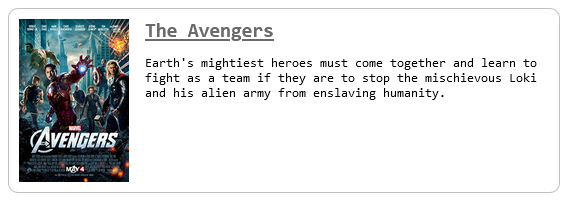

<h1 align="center">Movies (API and Plugin)</h1>


<p align="center">
    <br>
    Plugin to embed movie info on any website<br>
    
    
    
    
    
    <br><b>Author:</b> Carlos Alves - <a href="https://github.com/EuCarlos">@EuCarlos</a>
</p>

🌐 _Para a versão em português deste README, [clique aqui](./docs/locales/pt_BR/README.md)._

## Installation
Clone the repository and install dependencies using Yarn in the `/api` directory:
```bash
git clone https://github.com/EuCarlos/movies-api-and-plugin \
  && cd movies-api-and-plugin/api/ \
  && yarn install
```

## How to use
To embed the plugin in your html just add a `script` tag importing the plugin javascript file and add slug in the `data-slug` attribute.
```html
    <script
        src="../plugin/dist/embed.min.js"
        data-slug="the-avengers-0848228"
    ></script>
```

NOTE: `data-slug` accepts slug, title and/or id if they are correct.

## How to contribute to this project?
Before starting, check and follow the instructions for contributing to the repository. If not, you can follow the instructions below:

1. Fork the project
2. Create a new branch: git checkout -b nova-branch
3. Commit your changes: git commit -m 'I added something'
4. Push to branch: git push origin nova-branch
5. Open a Pull Request

## How do I report a bug or request a feature?
If you want to report a bug or request a feature, go to [Issue](https://github.com/eucarlos/movies-api-and-plugin/issues) on the GitHub Project and add your request.