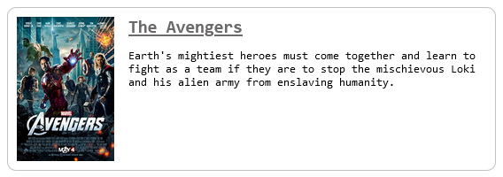

<h1 align="center">Movies (API and Plugin)</h1>


<p align="center">
    <br>
    Plugin para incorporar informações do filme em qualquer site<br>
    
    
    
    
    
    <br><b>Autor:</b> Carlos Alves - <a href="https://github.com/EuCarlos">@EuCarlos</a>
</p>

## Instalação
Clone o repositório e instale as dependências usando o Yarn no diretório `/api`:
```bash
git clone https://github.com/EuCarlos/movies-api-and-plugin \
  && cd movies-api-and-plugin/api/ \
  && yarn install
```

## Como usar
Para embutir o plugin no seu html basta adicionar uma tag `script` importando o arquivo javascript do plugin e adicionar slug na atributo `data-slug` 
```html
    <script
        src="../plugin/dist/embed.min.js"
        data-slug="the-avengers-0848228"
    ></script>
```

OBS.: `data-slug` aceita slug, titulo e/ou o id se estiverem corretos.

## Como contribuir com este projeto?
Antes de começar verifique e siga as instruções para contribuição do repositório. Caso não possua você pode seguir as instruções abaixo:

1. Faça Fork do projeto
2. Crie uma nova branch: git checkout -b nova-branch
3. Commit suas mudanças: git commit -m 'Adicionei alguma coisa'
4. Push para a branch: git push origin nova-branch
5. Abra um Pull Request

## Como reportar um erro ou solicitar recurso?
Caso deseja reportar um erro ou solicitar um recurso, acesse [Issue](https://github.com/eucarlos/movies-api-and-plugin/issues) no Projeto GitHub e adicione sua requisição.